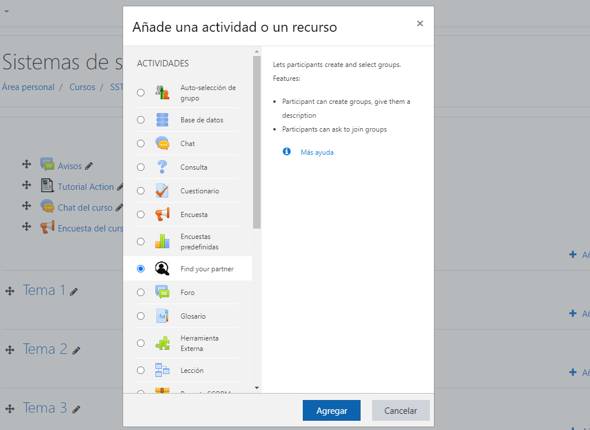
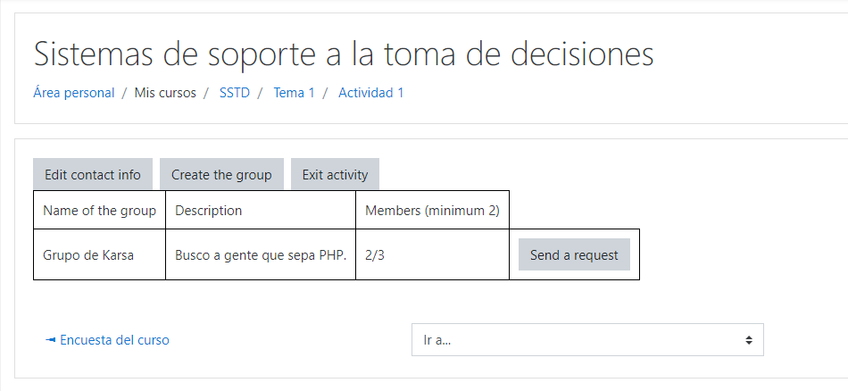
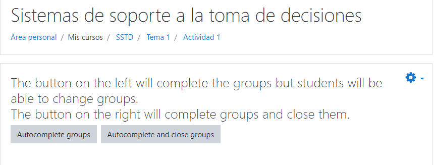
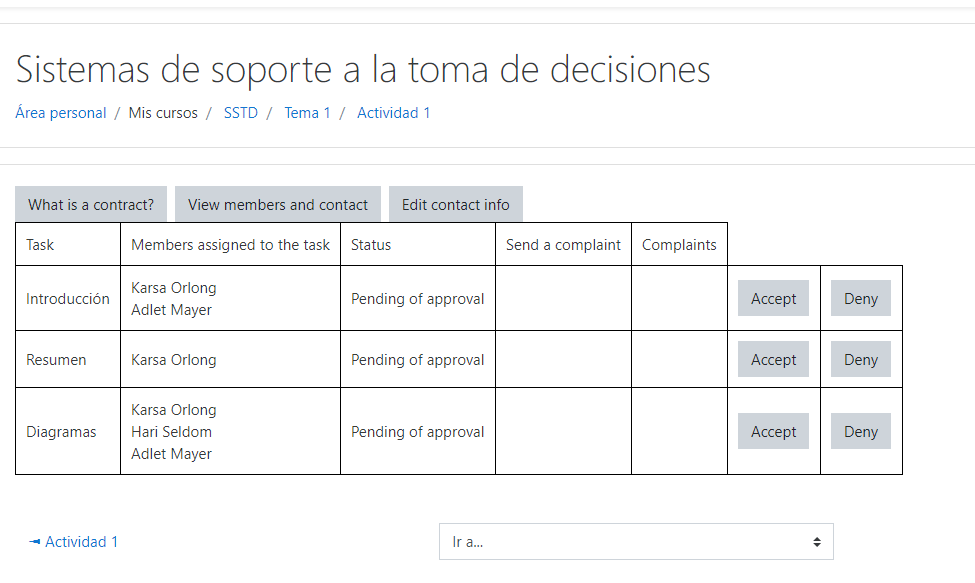

# Find your partner #

* Copyright (C)   2020 Rodrigo Aguirregabiria Herrero
* Copyright (C)   2020 Manuel Alfredo Collado Centeno
* Copyright (C)   2020 GIETA Universidad Politécnica de Madrid (http://gieta.etsisi.upm.es/)

* Students can create groups and give them a description
* Students can ask to join groups
* Group creator is the admin of the group and will manage the request that the group recieves
* Given a date, the groups will autocompleted
* A teacher can autocomplete groups
* Students can make contracts, that are a way to divide the work in an activity

Teachers can add the activity to a course and will be asked to set a name, description, minimum of members, maximum of members, date to close groups, and date to end the activity.

Students can ask to join groups or create one. Students must send a contact method so the members of the group can reach them.

The teacher can close groups before the date to close groups comes. If not the groups will autocomplete when the date to close groups comes.

Once the groups are closed, the students of a group will vote to make contracts. Contracts divide the work in a project and the teacher will be able to see them.

## License ##

2020 Rodrigo Aguirregabiria Herrero, Manuel Alfredo Collado Centeno, GIETA UPM

This program is free software: you can redistribute it and/or modify it under
the terms of the GNU General Public License as published by the Free Software
Foundation, either version 3 of the License, or (at your option) any later
version.

This program is distributed in the hope that it will be useful, but WITHOUT ANY
WARRANTY; without even the implied warranty of MERCHANTABILITY or FITNESS FOR A
PARTICULAR PURPOSE.  See the GNU General Public License for more details.

You should have received a copy of the GNU General Public License along with
this program.  If not, see <http://www.gnu.org/licenses/>.
